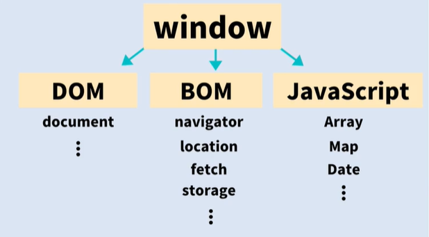
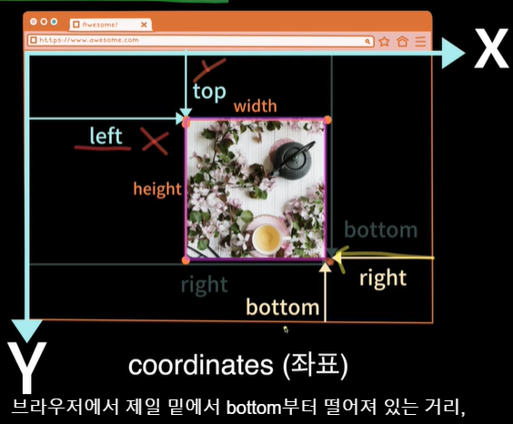

# Web APIs 넌 누구냐?

> APIs = Application Programming Interfaces
> 
> 내부 동작은 몰라도 In and Out
***
## Web APIs

* DOM APIs
* Network APIs
* Graphics APIs
* Audio/Video APIs
* Device APIs
* File APIs
* Storage APIs

> HTTP(HyperText Transfer Protocal)
> 
> Request & Response 기반


# Browser 구조 분석 😁

> Window, Document, Navigator
> 
> **Window가 글로벌 오브젝트 이다**

```javascript
console.log(this) // window
console.log(innerWidth) //this.innerWidth
alert(); // window 
```


# Window 사이즈 표기 

* **`resize` 이벤트 활용!**

```javascript
const container = document.querySelector("#container");
function change(){
    const screenWidth = window.screen.width;
    const screenHeight = window.screen.height;
    const outerWidth = window.outerWidth;
    const outerHeight = window.outerHeight;
    const innerWidth = window.innerWidth;
    const innerHeight = window.innerHeight;
    container.innerText =
    `window.screen: ${screenHeight}, ${screenWidth} 
     window.outer: ${outerWidth}, ${outerHeight}
     window.inner: ${innerWidth}, ${innerHeight}
    `
}
change();
window.addEventListener("resize",change);
```

# 브라우저 좌표

* coordinates
* Element.getBoundingClientRect()
* client x,y 는 브라우저 좌표
* page x,y 는 html 좌표



```javascript
const container = document.querySelector("#container");
const num = 25;
const special = 8;

const by_100px = document.querySelector("#by_100px");
const to_100px = document.querySelector("#to_100px");
const by_special = document.querySelector("#by_special");

let special_div;

function createDIV() {
    for(let i=0;i<num;i++){
        const div = document.createElement("div");
        container.appendChild(div);
        if(i==special) {
            div.id = "special";
            div.style.backgroundColor="rosybrown";
            special_div = document.querySelector("#special");
        }
        const rect = div.getBoundingClientRect();
        div.addEventListener('click',()=>{console.log(rect);});
    }
}
createDIV();
by_100px.addEventListener('click',()=>{
    scrollBy(0,100);
})

to_100px.addEventListener('click',()=>{
    scrollTo(0,100);
})

by_special.addEventListener('click',()=>{
    special_div.scrollIntoView();
})


window.addEventListener("load", ()=>{
    console.log("asd");
})
```
